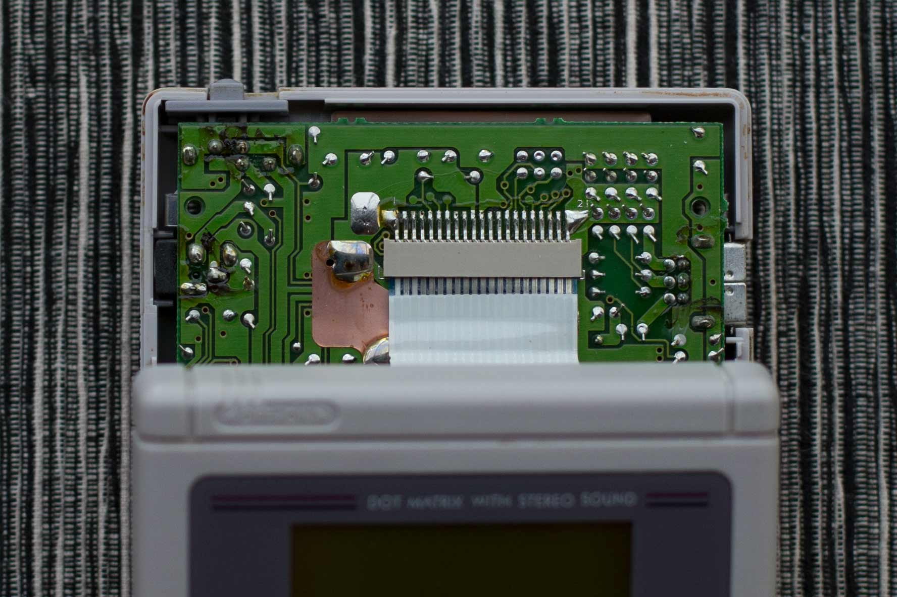
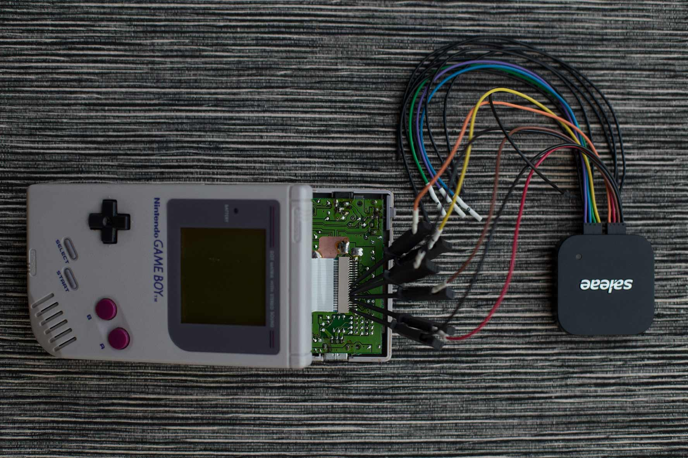

# Sniff your Game Boy's LCD using a logic analyzer

**or How to Take Screenshots the Hard Way.**

So, you want to immortalize your Tetris high score for future generations? You could do it the easy way and snap a photo of the screen with your smartphone. Or, gasp, take a screenshot when playing on an emulator.

But what fun is that?

Wouldn't it be cool to crack open your old brick, peek at the LCD data bus and extract the screenshot from there? Let's do it!


## Before you begin

You'll need a handful of stuff to get started:

* An [Original Game Boy][dmg] to play with.

* A [tri-point screwdriver][screwdriver] to open the Game Boy.

* The [Saleae Logic 8][saleae] logic analyzer.

* [Logic Software][logic] for capturing and analyzing the data.

This guide assumes you are using Saleae's logic analyzer and software, but you don't have to. Use any logic analyzer and software you want.

I think you will be able to follow along fine nevertheless, but you may have to deviate from my instructions from time to time.

## Open up your Game Boy

Opening up the Game Boy is easy! Once you've got hold of a tri-point screwdriver, that's it.


There are six screws on the back that needs loosing: four along the edges and two that you will find hiding behind the batteries, once you've removed them.

## Connect test clips to data bus

When the Game Boys guts are exposed, you will see that the back and front PCBs are connected with a ribbon cable.



You're going to tap into the connector on the back PCB using test clips of your Logic 8. If you squint your eyes hard enough, you may see that the contacts of the connector are numbered 1 to 21 from left to right.

Attach test clips to contact number 12, 14, 15, 16, 17 and 21 using the table below. Test clip number 3 (orange cable) goes to contact number 12 (V-Sync), and so on.

| Test clip |  Color | Connection | Function    |
|:---------:|:------:|:----------:|-------------|
| 0         | Black  | 15         | LCD Data 0  |
| 1         | Brown  | 16         | LCD Data 1  |
| 2         | Red    | 17         | H-Sync      |
| 3         | Orange | 12         | V-Sync      |
| 4         | Yellow | 14         | Pixel Clock |
| GND       | Black  | 21         | Ground      |

When you are done attaching test clips, it should look something like this.



## Record them ones and zeroes

Now when you're all hooked up, it's time to connect the Logic 8 to your computer and fire up the Logic Software. I won't go into to much detail about the application menus, take a look at the [User Guide from Saleae][userguide] if you're feeling lost.

### Setup channels and collect data


First thing first: start by choosing the channels you want to record. If you followed along earlier it should be channel 0-4.


Then start collecting data by pressing the big green Start button. I've choosed to add a trigger on the rising edge of the V-Sync signal.

In the screenshot above you can see my recording. I've named the channels for clarity and zoomed in on a single frame. Right now we are looking at the signals that makes up a full Game Boy screen!

### About the signals

So how does these signals work together? The V-Sync pulse initializes the drawing of a new frame. The pixels are then plotted from top to bottom, line by line, driven by the H-Sync pulse.

One pixel is drawn on each negative edge of the Pixel Clock. Data 0 and Data 1 makes up the two bits that determines the shade of grey of an individual pixel.

```
0b00 = White
0b01 = Light grey
0b10 = Dark grey
0b11 = Black
```

### Exporting pixel data

You could decode those signals visually to get all the pixel grey values, but that would take a whole lot of time. Let's add an analyzer to do the hard work.


Choose the "Simple Parallel" analyzer and use DATA 1 for D0, DATA 0 for D1 and PIXEL CLOCK for Clock, like in the screenshot above. Make sure to pick "Data is valid on Clock falling edge" aswell.


Now add a Timing Marker Pair to select a single frame, like the screenshot above. Then click the cog to the right of "Decoded Protocols" and choose "Search Between Timing Markers".

Again, under the cog to the right of Decoded Protocols, you will find the option to Export search result.

This will give you a comma-separated value file with all the pixel grey values, like this:

| Time [s]          | Analyzer Name | Decoded Protocol Result |
|-------------------|---------------|-------------------------|
| 0.016654640000000 | Pixel Data    | '0'                     |
| 0.016656660000000 | Pixel Data    | '3'                     |
| 0.016656900000000 | Pixel Data    | '1'                     |

There will be more than three pixels, though. The Game Boy screen size is 160 × 144 pixels so there should be a total of 23,040 lines, excluding the header, in the exported file.

## Extract a screenshot

Almost there! With all these pixel values you can generate an image. You could do it manually, pixel for pixel, or write a program to do it for you.

Actually, I've already [hacked together that program][ld2img] for you. It's written in portable C so it should run about anywhere.

Download or checkout this repository and compile by running make:

```sh
$ git clone https://github.com/svendahlstrand/game-boy-lcd-sniffing.git
$ cd game-boy-lcd-sniffing
$ make
$ ./bin/ld2img -o screenshot.pgm your-export.csv

```

This will hopefully end with an [PGM image][pgm] named screenshot.pgm, watch it in all it's glory and congratulate yourself for a job well done.

  

Here's three screenshot I took using this technique from Kid Dracula, Mole Mania and Solomon's Key. Try them if you haven't, they're all great games!

## ~~Common~~ My  mistakes

The road to that image was a bumpy one for me. Here are some trouble I ran into, maybe it will help you avoid falling in the same hole.


My first exported image looked like this. It looks like an old undeveloped film from a camera. This was a programming mistake from my side, [solved by this little line][negative].


The second attempt looked much better, but still a litte of. This time I had set up my analyzer wrong in the Logic Software. Changing to "Data is valid on Clock **falling** edge" solved the problem.


Wow, this looks awesome! Right? Not quite... I had mixed up the DATA 0 and DATA 1 signals in the analyzer settings as well. This mixes upp the grey values: light grey goes dark and vice versa.

Thankfully it was an easy fix: I just had to select the correct channels for D0 and D1 in the Analyzer Settings window.


That's more like it!

[dmg]: https://en.wikipedia.org/wiki/Game_Boy
[screwdriver]: https://en.wikipedia.org/wiki/List_of_screw_drives#Tri-point
[saleae]: https://www.saleae.com
[logic]: https://www.saleae.com/downloads
[userguide]: http://support.saleae.com/hc/en-us/categories/201256716-Users-Guide-Documentation
[pgm]: http://netpbm.sourceforge.net/doc/pgm.html
[ld2img]: blob/master/src/ld2img.c
[negative]: blob/master/src/ld2img.c#L33
